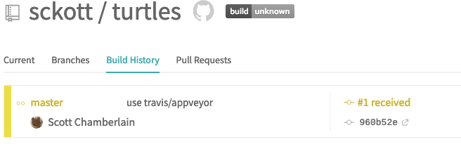
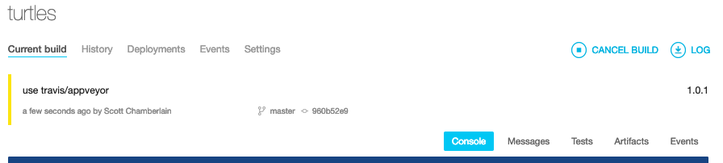
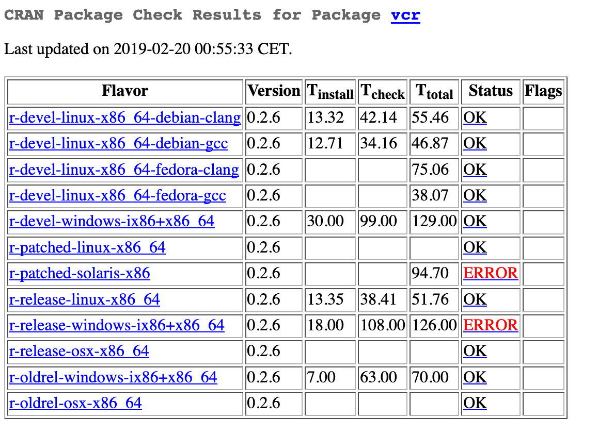
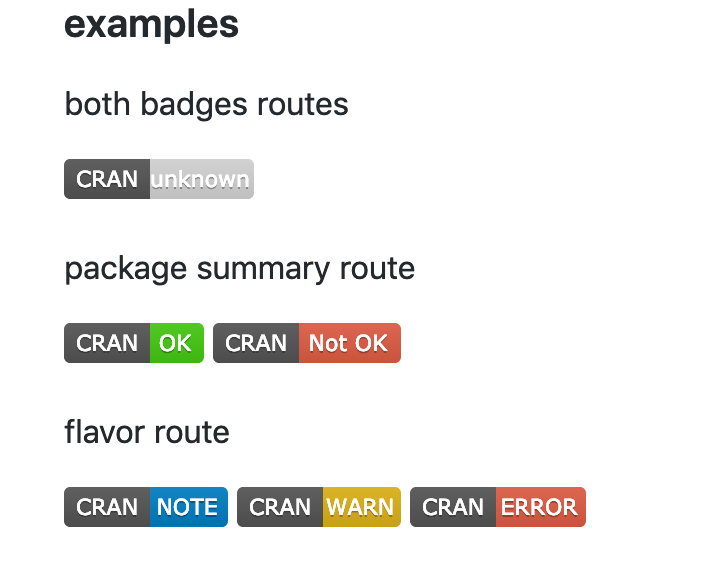

## .large[What's CI?]

### CI: Continuous Integration

ref: <https://www.thoughtworks.com/continuous-integration>

> Continuous Integration (CI) is a development practice that requires developers to integrate code into a shared repository several times a day. Each check-in is then verified by an automated build, allowing teams to detect problems early. 

---

## .large[What's CI?]

<br><br><br>

<center><h3>make sure your software doesn't just work on your machine</h3></center>
<br>
<ul>
  <li style="font-size:30px";>&amp; works on other operating systems</li>
  <li style="font-size:30px";>&amp; works on other R versions</li>
  <li style="font-size:30px";>&amp; works in XXX other contexts</li>
</ul>

---

## .large[usethis approach]

create a package, use git

```r
usethis::create_package("turtles")
usethis::use_git()
```

create repo on github, push up

```sh
cd turtles
hub create sckott/turtles
git push --set-upstream origin master
```

use travis and/or appveyor

```r
usethis::use_travis()
usethis::use_appveyor()
```

---

## .large[yaml files]

`.travis.yml`

```yaml
language: R
sudo: false
cache: packages
```

`.appveyor.yml`

Looks similar-ish

<hr>

Travis R docs <https://docs.travis-ci.com/user/languages/r/>

Appveyor sort of docs <https://github.com/krlmlr/r-appveyor>

---

## .large[yaml: more complicated]

```yaml
language: r

matrix:
  include:
    - os: linux
      r: oldrel
    - os: linux
      r: release
      env: R_CODECOV=true
    - os: linux
      r: devel
      env: _R_CHECK_LENGTH_1_LOGIC2_=TRUE
    - os: osx
      osx_image: xcode7.3
      r: oldrel

r_binary_packages:
  - covr
  - httr

after_success:
  - if [[ "${R_CODECOV}" ]]; then R -e 'covr::codecov()'; fi
```

---

## .large[CI in action]




---

## .large[seealso: tic and travis]

<https://github.com/ropenscilabs/tic>

<https://github.com/ropenscilabs/travis>


```r
# install.packages("remotes")
remotes::install_github("ropenscilabs/tic")
remotes::install_github("ropenscilabs/travis")
```

---

## .large[CRAN checks]

<https://cran.rstudio.com/web/checks/check_results_vcr.html>



---

## .large[CRAN checks API]

<https://github.com/ropensci/cchecksapi>


